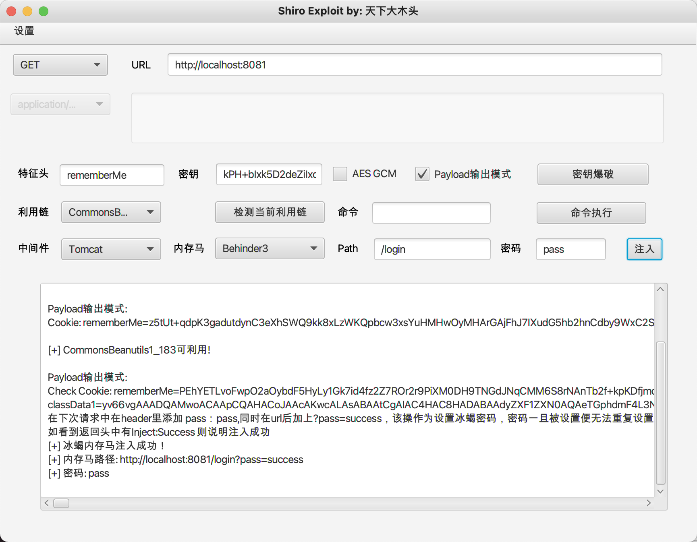

# ShiroExploit
Shiro 可视化利用工具（beta

## 免责声明
该项目仅供合法的渗透测试以及爱好者参考学习，请各位遵守《中华人民共和国网络安全法》以及相应地方的法律，禁止使用该项目进行违法操作，否则自行承担相关责任

### 目前已实现：
1. 支持密钥爆破以及 CBC/GCM 两种加密模式
2. 可修改特征头，可进行 GET/POST 发包，可选择对应的 Content-Type
3. 支持检测利用链是否可用（Tomcat）
4. 支持命令执行回显（Tomcat）
5. 支持多版本 jar ，目前依赖中 CommonsBeanutils1 为 1.9.2 版本，CommonsBeanutils1_183 为 1.8.3 版本（后续会增加更多不同版本的利用链）
6. 支持 Payload 输出模式，开启后工具的 payload 都会进行输出
7. 冰蝎3内存马注入
8. 支持 http/socks 代理，在设置中可设置代理
9. 支持自定义 header 功能，因为有的场景下需要特定header才会回显 deleteMe ，否则会出现检测不到的情况，在设置中可进行自定义header

### 暂未实现
1. ~~冰蝎3内存马注入~~、哥斯拉内存马注入、reGeorg内存马注入
2. Weblogic组件部分利用
3. 特征修改
4. 文件上传功能

利用效果：

### 参考
感谢前辈们的优秀文章和优秀项目 

冰蝎: https://github.com/rebeyond/Behinder

shiro_attack: https://github.com/j1anFen/shiro_attack

内存马注入思路: https://mp.weixin.qq.com/s/r4cU84fASjflHrp-pE-ybg
